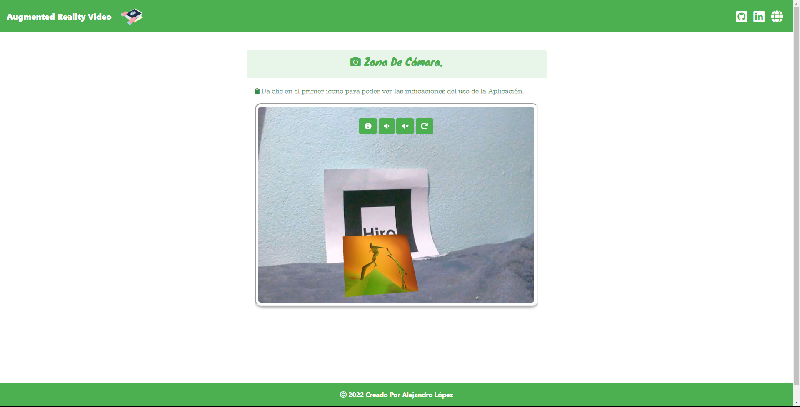

# <h1 align="center" style="color: #43a047;"> Augmented Reality Video 👨🏻‍💻 <h1> <hr>


`A-Frame` is a web framework for building virtual reality (VR) experiences. A-Frame is based on top of HTML, making it simple to get started. But `A-Frame` is not just a 3D scene graph or a markup language; the core is a powerful entity-component framework that provides a declarative, extensible, and composable structure to` three.js`. <br><br>

This web application will allow you to watch videos through Augmented Reality (AR), with the `A-Frame` framework and the `AR.js` framework.
 <br><br><hr>  

## <p align="left" style="color: #43a047;"> Installation </p>

##### <p align="center" style="color: #a5d6a7;"><b> 1.- Download the repository. </b></p>

```bash
$ git clone https://github.com/Alejandro-190107/Augmented-Reality-Video.git
```
##### <p align="left" style="color: #a5d6a7;"><b> 2.- Download marker to be able to see the 3D models. </b></p>

- [Dowload Marker](https://raw.githubusercontent.com/AR-js-org/AR.js/master/data/images/hiro.png) 

##### <p align="left" style="color: #a5d6a7;"><b> 3.- Place the marker on the webcam to enjoy the `Augmented Reality (AR)` of the video, click the buttons to turn the sound of the video on or off
 </b></p>

## <p align="left" style="color: #43a047;"> Requirements </p>

- [HTML5](https://developer.mozilla.org/es/docs/Web/HTML) 
- [CSS3](https://developer.mozilla.org/es/docs/Web/CSS)
- [JavaScript](https://developer.mozilla.org/es/docs/Web/JavaScript)


## <p align="left" style="color: #43a047;"> References </p>

- [A-Frame](https://aframe.io/)
- [AR.js](https://github.com/jeromeetienne/AR.js)  
- [Types Of Models](https://blog.realidad-aumentada.com.co/modelos-3d-para-realidad-aumentada-usando-la-libreria-ar-js-a-frame-con-javascript/)

<hr>  

## <p align="left" style="color: #43a047;"> Screenshot Project 💻 </p>

🔶 [Project Website](https://alejandro-lopez.futuretecware.com/Augmented-Reality-Video/index.html)

